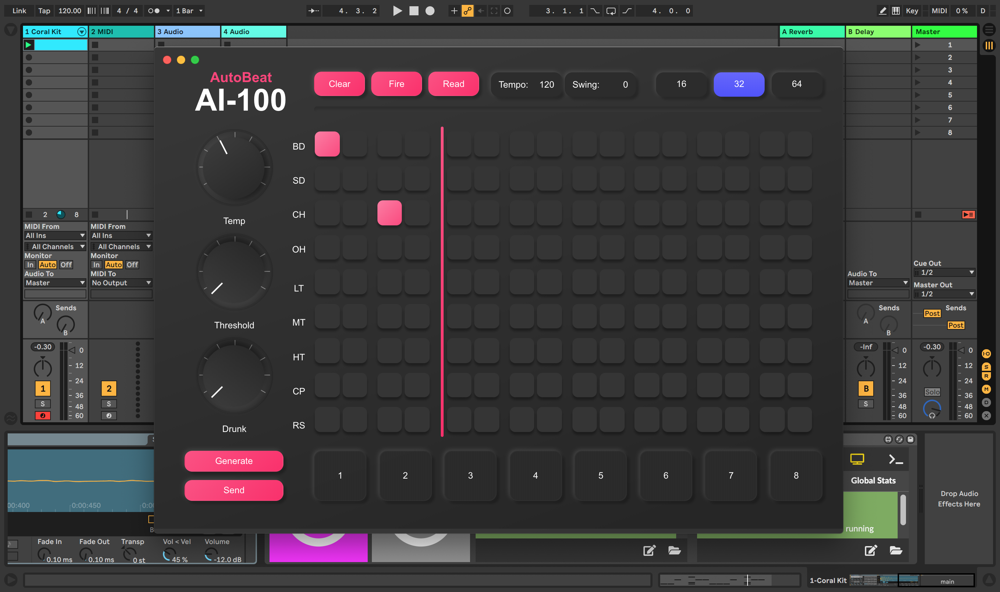

# AutoBeat - Intelligent AI drum machine for co-creative music production.

AutoBeat is a custom Ableton plugin that can autocompletes musical drum beats in real time from an idea fragment, leading to surprising and novel musical outcomes. The plugin is based on interacting with the Live Object Model through an interactive user interface, and producing ML outputs with a pretrained Magenta.js RNN model. This model allows for continuation and a density interpolation of user beats based on notes in the sequence.

The Max patch is the brain of this app. It pipes data between the UI and Ableton: UI -> Node -> Max -> Live API -> Max -> Node -> UI. The Max patch runs multiple JS scripts and two node processes. Two nodes processes are required because the Max API is only available in the node process that's evoked by node.script in the max patch. Therefore to interact with Ableton programmatically from the UI, two seperate processes are required. One that handles interaction with Ableton through Max, and one that runs the Electron process to create the interface. These instances then communicate using sockets.



DEMO [https://vimeo.com/481090771]

# Setup

To run this app, you'll need:
```
1.    NPM
2.    Max for live (M4L) or MaxMSP (if using MaxMSP update the main.amxd extension)
3.    Ableton Live
```

# Run
```
1.    Drag main.amxd into Ableton. Click the button labeled "Set up". Select an instrument such as a drum rack to use as a sampler
2.    Click the button labeled start. If something breaks you may need to run NPM i in the node directories. 
3.    To expand the Max code, you can open the patch editor and unfreeze the patch. 
```


